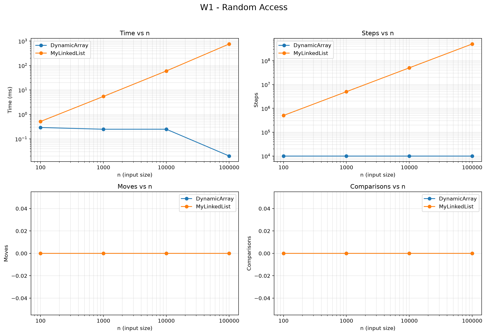
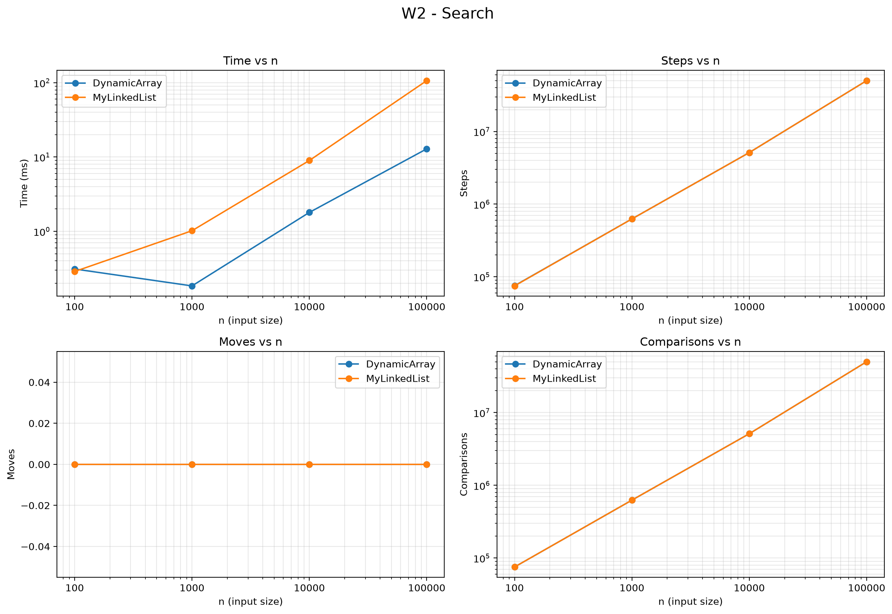
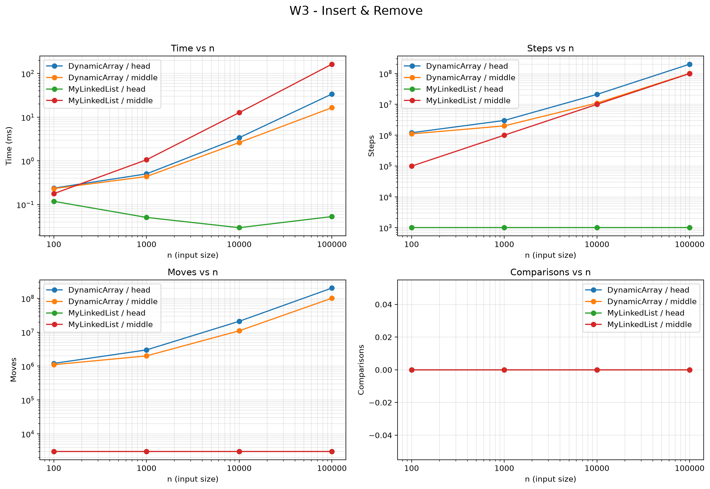
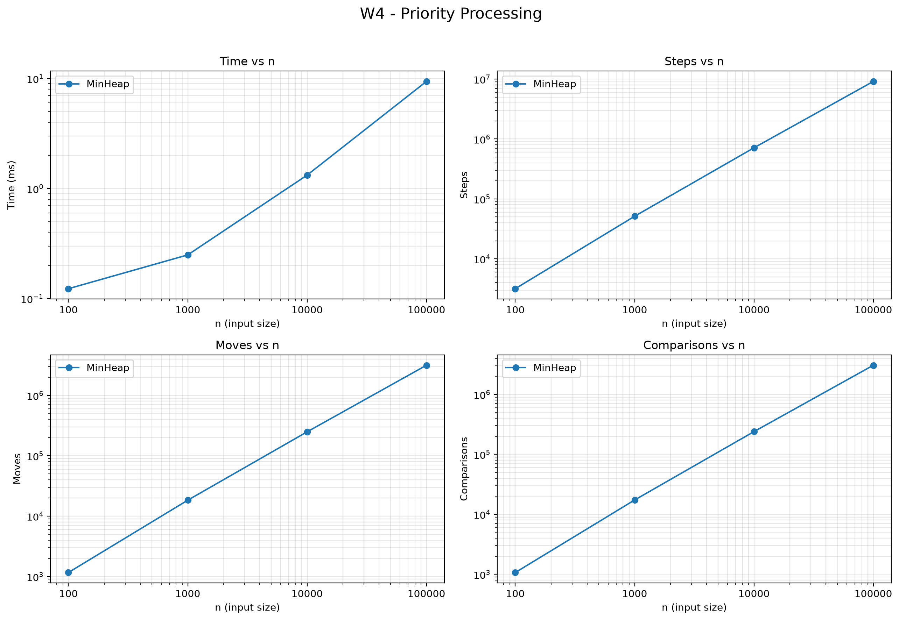
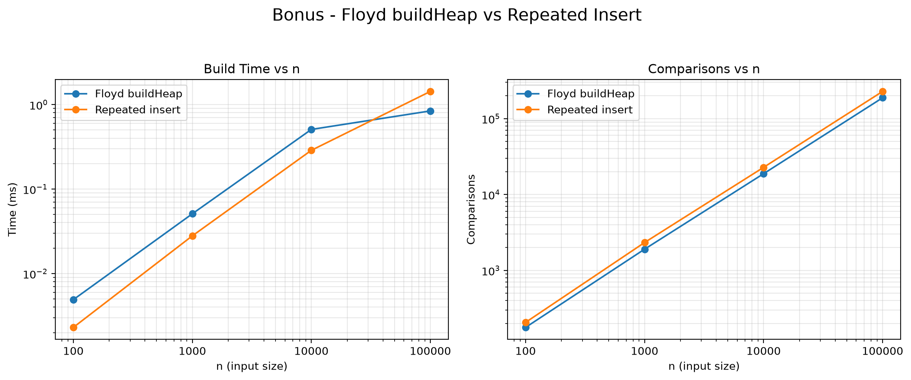

# Assignment 2 — Data Structures

**Student:** Akmaral Zhumabay  
**Group:** SE-2517  
**Course:** Design and Analysis of Algorithms  
**Instructor:** Taubakabyl Nurlybek

## 1. Overview

This project implements three data structures from scratch: `DynamicArray`, `MyLinkedList`, and `MinHeap`. All structures store primitive `int` values. The implementation also records physical operations using three metrics: steps, moves, and comparisons.

The benchmark uses input sizes n = 100, 1,000, 10,000, and 100,000 and evaluates four workloads: random access, search, insertion/removal, and priority processing.

---

## 2. Complexity Analysis

### DynamicArray

| Operation | Best | Average | Worst | Auxiliary Space | Justification |
|---|---|---|---|---|---|
| `add(x)` | Θ(1) | Θ(1) amortized | Θ(n) | O(n) during resize | Appending is constant time unless the internal array is full, when all elements must be copied to a 2x larger array. |
| `add(index, x)` | Θ(1) | Θ(n) | Θ(n) | O(n) during resize | Adding at the end can require no shifting, while insertion near the beginning shifts many elements. |
| `remove(index)` | Θ(1) | Θ(n) | Θ(n) | Θ(1) | Removing the last element requires no shifting; other positions may require shifting remaining elements. |
| `get(index)` | Θ(1) | Θ(1) | Θ(1) | Θ(1) | An array provides direct access using its index. |
| `contains(x)` | Θ(1) | Θ(n) | Θ(n) | Θ(1) | The value may be found immediately or the entire array may need to be scanned. |

Overall storage space: **Θ(n)**.

### MyLinkedList

| Operation | Best | Average | Worst | Auxiliary Space | Justification |
|---|---|---|---|---|---|
| `add(x)` | Θ(1) | Θ(1) | Θ(1) | Θ(1) | A tail reference allows direct insertion at the end. |
| `add(index, x)` | Θ(1) | Θ(n) | Θ(n) | Θ(1) | Head/end insertion can be constant time, while an internal index requires traversal. |
| `remove(index)` | Θ(1) | Θ(n) | Θ(n) | Θ(1) | Removing the head is constant time; other positions require traversal to the previous node. |
| `get(index)` | Θ(1) | Θ(n) | Θ(n) | Θ(1) | The list must follow links from the head until the requested index is reached. |
| `contains(x)` | Θ(1) | Θ(n) | Θ(n) | Θ(1) | Search stops immediately if the first node matches but may scan the entire list. |

Overall storage space: **Θ(n)**.

### MinHeap

| Operation | Best | Average | Worst | Auxiliary Space | Justification |
|---|---|---|---|---|---|
| `insert(x)` | Θ(1) | O(log n) | Θ(log n) | O(n) during resize | A value may already satisfy the heap property or may bubble from a leaf toward the root. |
| `peekMin()` | Θ(1) | Θ(1) | Θ(1) | Θ(1) | The minimum value is always stored at index 0. |
| `extractMin()` | Θ(1) | O(log n) | Θ(log n) | Θ(1) | After replacing the root, bubble-down may stop immediately or travel through the heap height. |

Overall storage space: **Θ(n)**.

---

## 3. Loop Invariant Proofs

### 3.1 DynamicArray `contains`

**Invariant:** Before each iteration with index `i`, none of the elements at indices `0` through `i - 1` is equal to the searched value.

**Initialization:** Before the first iteration, `i = 0`. No elements have been examined, so the invariant is true.

**Maintenance:** During an iteration, `data[i]` is compared with the searched value. If it is equal, the method returns `true`. Otherwise, `data[i]` is known not to match. Therefore, before the next iteration, all elements from index `0` through `i` have been checked and do not match.

**Termination:** The loop terminates either when a matching element is found or when `i == size`. If the loop reaches `size`, every stored element has been checked and none is equal to the searched value.

**Conclusion:** Therefore, `contains` returns `true` exactly when the value exists in the DynamicArray and returns `false` otherwise.

### 3.2 MinHeap `bubbleDown`

**Invariant:** Before each iteration, every subtree except possibly the subtree rooted at the current `index` satisfies the min-heap property. Any possible heap-property violation is located at the current node and its children.

**Initialization:** After `extractMin`, the final heap element is moved to the root. The subtrees below the root were already valid heaps, so only the new root may violate the heap property.

**Maintenance:** The algorithm compares the current node with its existing left and right children and selects the smallest value. If a child is smaller, the current node is swapped with the smallest child. The old position is then valid, and any remaining violation can only be at the new position of the moved value. Therefore, the invariant remains true before the next iteration.

**Termination:** The loop stops when the current node is no greater than either child, or when it has no smaller child. At that point there is no remaining violation at the current position, while all other subtrees already satisfy the heap property.

**Conclusion:** Therefore, when `bubbleDown` terminates, the complete array satisfies the min-heap property.

---

## 4. Benchmark Method

All workloads use the same input sizes:

- 100
- 1,000
- 10,000
- 100,000

Input values are generated reproducibly using `new Random(42)`.

Each measured case is executed five times and the median running time is stored. A warm-up run is performed before measurement to reduce JVM JIT compilation effects. Running time is measured with `System.nanoTime()` and converted to milliseconds.

The recorded metrics are:

- **steps:** an array-cell read or movement to the next linked-list node;
- **moves:** an array element shift/copy or linked-list pointer update;
- **comparisons:** comparison between stored element values.

The complete measurements are stored in `results/results.csv`.

---

## 5. Benchmark Results

### W1 — Random Access

DynamicArray performs 10,000 steps regardless of n because every `get(index)` directly accesses one array cell. MyLinkedList requires increasingly many node traversals as n grows.

### W2 — Search

Both structures perform a similar number of logical comparisons because both use linear search. However, DynamicArray generally achieves lower running time for large n because its elements occupy contiguous memory.

### W3 — Insert & Remove

MyLinkedList performs very well for operations at the head because links can be updated without shifting existing elements. DynamicArray performs many moves at the head and middle because array elements must be shifted. For middle operations, MyLinkedList must traverse to the requested position, which becomes increasingly expensive as n grows.

### W4 — Priority Processing

MinHeap efficiently processes values according to priority. Insertions use bubble-up and removals use bubble-down. Both operations are bounded by the height of the binary heap, which is logarithmic in n.

---

## 6. Discussion

DynamicArray is especially efficient for random access because an element can be located directly from its index. Its elements are stored contiguously in memory, which also provides good spatial locality and makes effective use of CPU cache lines. MyLinkedList cannot directly calculate the address of an element, so `get(i)` must follow node references from the head. This pointer chasing causes substantially more steps as the requested index grows. Linked-list nodes are also separate objects and therefore may be located in different areas of memory. This can produce more cache misses even when two algorithms appear to perform a similar number of logical operations. Node objects additionally require object headers and references, increasing memory overhead and garbage-collector work. The search workload demonstrates that equal asymptotic complexity does not imply equal real running time, since both structures have Θ(n) search but DynamicArray benefits from contiguous storage. DynamicArray becomes less attractive for insertion and removal near the beginning because many elements have to be shifted. MyLinkedList is a better choice when frequent insertion and removal occur at the head or at a position for which a node reference is already available. However, indexed middle operations on this linked list still require traversal and are therefore Θ(n). MinHeap is the appropriate choice when the workload repeatedly needs access to the smallest-priority item. Its minimum is available in Θ(1) time through `peekMin`, while insertion and extraction require at most logarithmic heap adjustment. The benchmark therefore shows that the best structure depends not only on Big-O complexity but also on the access pattern, memory layout, and constant hardware costs.

---

## Bonus — Floyd's O(n) buildHeap

An additional `buildHeap(int[] array)` operation was implemented using Floyd's bottom-up heap construction algorithm. Instead of inserting every element separately, the input values are first copied into the heap array. Bubble-down is then performed from the last non-leaf node (`n / 2 - 1`) back to the root.

Repeated insertion builds a heap using n individual `insert` operations, each of which may require bubble-up and has a worst-case cost of O(log n). Therefore, the conventional repeated-insertion approach has an O(n log n) upper bound. Floyd's algorithm constructs the heap in O(n) time because most nodes are near the leaves and can move only a small distance during bubble-down.

The measured results compare median construction time and element-comparison count for the same input generated with `Random(42)`. Floyd's bottom-up construction generally requires fewer comparisons and less work than building the heap through repeated insertion, especially as n increases.

## 7. Conclusion

The three custom data structures demonstrate different performance trade-offs. DynamicArray provides fast indexed access and strong cache locality, MyLinkedList provides efficient boundary updates without array shifting, and MinHeap provides efficient priority-based processing. The measured operation counts and running times are consistent with the expected behavior of these structures and demonstrate why structures with similar asymptotic bounds can still have substantially different practical performance.